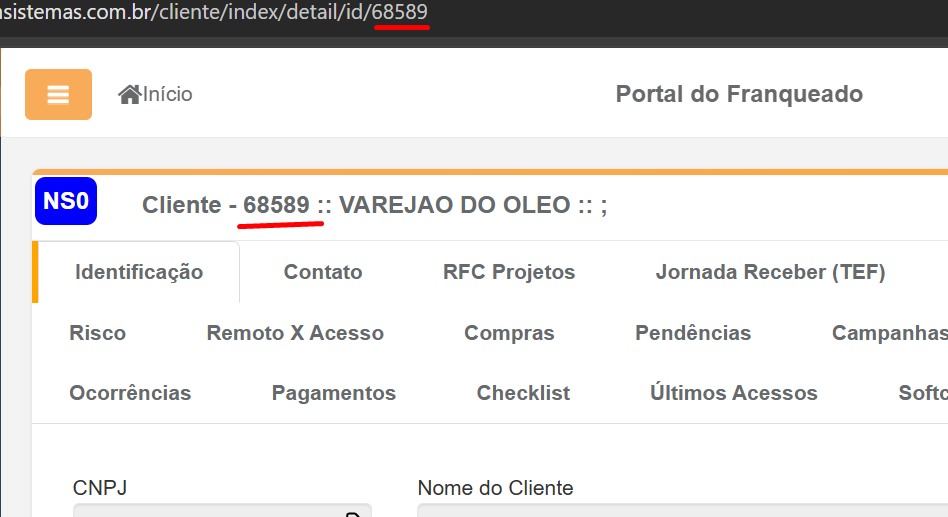
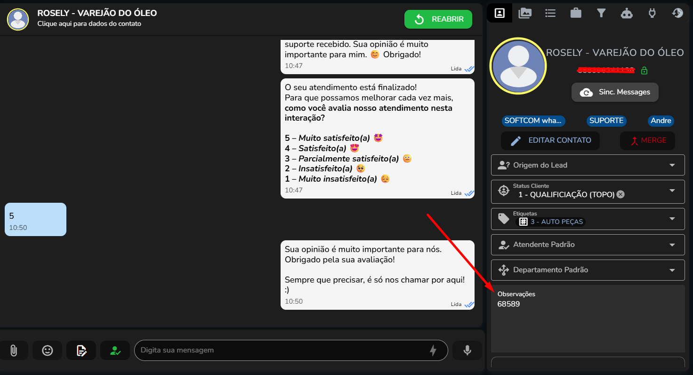
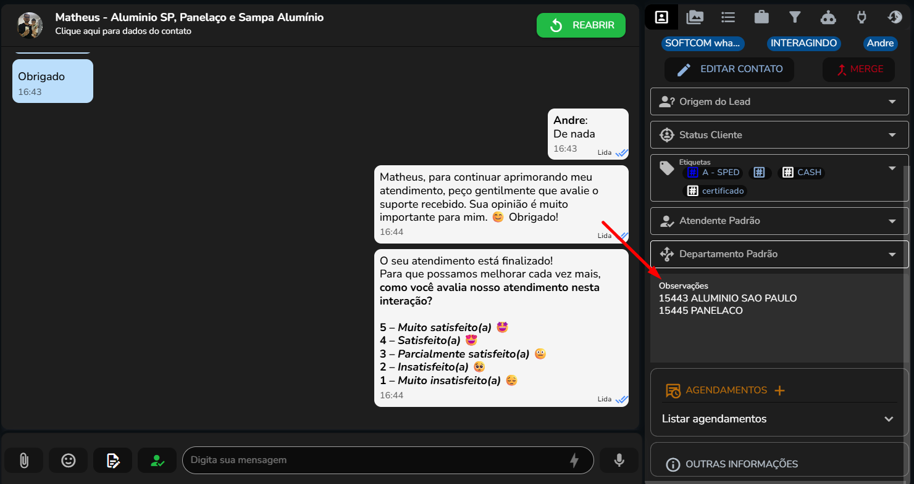

## Extensão Softcom Patos

Esta extensão integra o Cliente Satisfeito – ferramenta de chat utilizada na Softcom Patos – com a Área Partner, automatizando processos e otimizando a experiência de uso.

### Funcionalidades

- Ver cliente atual do chat na área partner;
- Ver prospectado atual do chat na área partner;
- Criar ocorrência para o cliente atual do chat, inserindo automáticamente nome e telefone no formulário;
- Transcrição de audio enviado pelo cliente para texto;
- Preenchimento automático do formulário de ocorrência, com predefinições para SPED;
- Botão de copiar os digitos do CNPJ do cliente na área partner;
- "Poços" de tamanho maior na área partner, facilitando visualização das ocorrências e deixando a tela mais limpa.
- Botão "Arquivar Todos" para arquivar todas as suas ocorrências de uma só vez.

### Instalação

1. Abra o Chrome ou navegador semelhante.
2. Vá em **Extensões** → **Modo Desenvolvedor**.
3. Clique em **Carregar sem compactação** e selecione a pasta desse projeto.
4. Atualize qualquer página que você já tenha aberto (do cliente satisfeito ou área partner) para que a extensão seja carregada corretamente.

**Vídeo tutorial:**
[Como instalar](docs/COMO-INSTALAR.mp4).

### Guia de uso

Para fazer a integração entre o Cliente Satisfeito e a Área Partner, é preciso pegar o **código** do cliente na área partner e inseri-lo nas **observações** do cliente no Cliente Satisfeito.

Para contatos no Cliente Satisfeito que estão relacionados a múltiplos clientes – contabilidade, por exemplo – é possível inserir mais de um código nas observações, que devem ser separados por uma quebra de linha e podem ser seguidos pelo nome do cliente após um espaço, para facilitar a sua identificação.

### Limitações Conhecidas

- A extensão depende da estrutura HTML das páginas do ClienteSatisfeito e da Área Partner. Alterações nessas plataformas podem causar mau funcionamento, exigindo atualizações corretivas. Os seletores HTML utilizados estão disponíveis em `html-selectors.js`.
